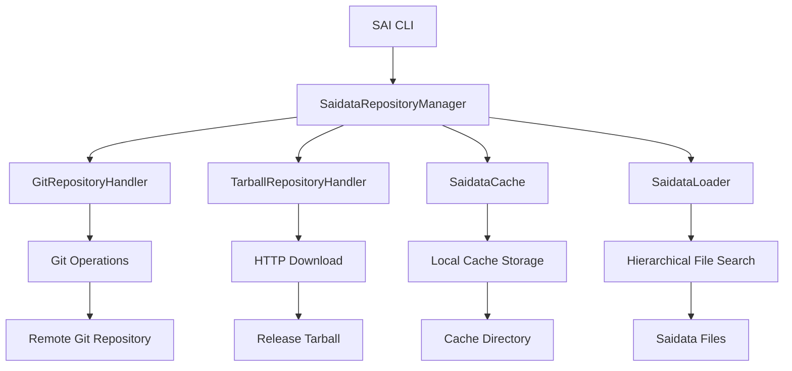
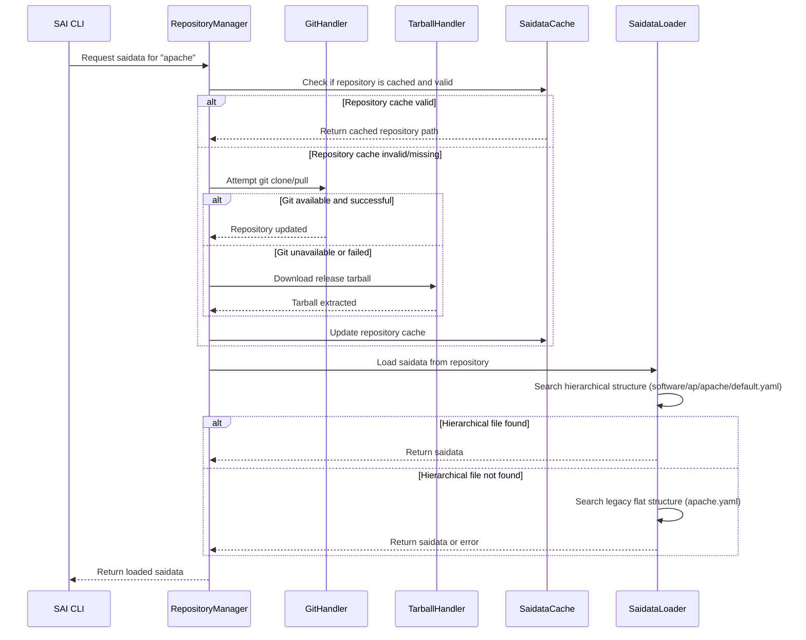
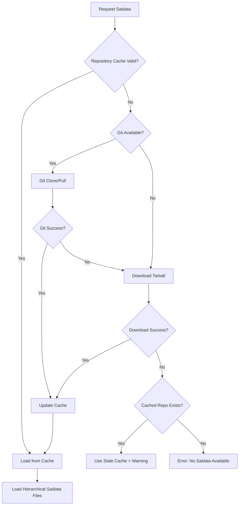

# Design Document

## Overview

This design implements a configurable git repository system for SAI saidata management, replacing the current local directory-based approach. The system will automatically fetch saidata from a configurable git repository (defaulting to `https://github.com/example42/saidata`) with fallback mechanisms for offline operation and git unavailability. The design also introduces a hierarchical directory structure for better organization and scalability.

## Architecture

### High-Level Architecture



### Repository Management Flow



## Components and Interfaces

### 1. SaidataRepositoryManager

**Purpose:** Central coordinator for repository operations and saidata loading.

**Key Methods:**
- `get_saidata(software_name: str) -> SaiData`
- `update_repository(force: bool = False) -> bool`
- `get_repository_status() -> RepositoryStatus`
- `configure_repository(url: str, auth_config: Optional[AuthConfig] = None)`

**Configuration Integration:**
```python
class SaiConfig(BaseModel):
    # Existing fields...
    
    # New repository configuration
    saidata_repository_url: str = "https://github.com/example42/saidata"
    saidata_repository_branch: str = "main"
    saidata_repository_auth: Optional[Dict[str, str]] = None
    saidata_auto_update: bool = True
    saidata_update_interval: int = 86400  # 24 hours in seconds
    saidata_offline_mode: bool = False
    saidata_repository_cache_dir: Optional[Path] = None  # Defaults to cache_directory/repositories
```

### 2. GitRepositoryHandler

**Purpose:** Handles git-based repository operations.

**Key Methods:**
- `clone_repository(url: str, target_dir: Path) -> bool`
- `update_repository(repo_dir: Path) -> bool`
- `is_git_available() -> bool`
- `get_repository_info(repo_dir: Path) -> RepositoryInfo`

**Features:**
- Git availability detection
- Authentication support (SSH keys, tokens)
- Branch/tag specification
- Shallow clones for performance
- Error handling and retry logic

### 3. TarballRepositoryHandler

**Purpose:** Handles tarball-based repository downloads as fallback.

**Key Methods:**
- `download_latest_release(url: str, target_dir: Path) -> bool`
- `extract_tarball(tarball_path: Path, target_dir: Path) -> bool`
- `get_release_info(url: str) -> ReleaseInfo`

**Features:**
- GitHub releases API integration
- Checksum verification
- Progress reporting for large downloads
- Atomic extraction (temp directory + move)

### 4. HierarchicalSaidataLoader

**Purpose:** Saidata loader supporting the new hierarchical directory structure.

**Key Methods:**
- `find_saidata_files(software_name: str, search_paths: List[Path]) -> List[Path]`
- `load_hierarchical_saidata(software_name: str, base_path: Path) -> Optional[Path]`

**Search Strategy:**
1. **Hierarchical Structure:** `software/{first_two_letters}/{software_name}/default.yaml`
2. **Custom Paths:** User-configured saidata paths (highest precedence, also using hierarchical structure)

### 5. RepositoryCache

**Purpose:** Manages repository caching and update tracking.

**Key Methods:**
- `is_repository_valid(repo_path: Path) -> bool`
- `get_last_update_time(repo_path: Path) -> Optional[datetime]`
- `mark_repository_updated(repo_path: Path)`
- `cleanup_old_repositories()`

**Cache Structure:**
```
~/.sai/cache/
├── repositories/
│   ├── saidata-main/          # Default repository
│   ├── custom-repo-branch/    # Custom repositories
│   └── .repository_metadata   # Cache metadata
├── saidata.json              # Existing saidata cache
└── providers.json            # Existing provider cache
```

## Data Models

### Repository Configuration
```python
@dataclass
class RepositoryConfig:
    url: str
    branch: str = "main"
    auth_type: Optional[str] = None  # "ssh", "token", "basic"
    auth_data: Optional[Dict[str, str]] = None
    shallow_clone: bool = True
    timeout: int = 300

@dataclass
class RepositoryStatus:
    url: str
    branch: str
    last_updated: Optional[datetime]
    local_path: Path
    is_git_repo: bool
    has_updates_available: bool
    error_message: Optional[str] = None
```

### Hierarchical Path Resolution
```python
@dataclass
class SaidataPath:
    software_name: str
    hierarchical_path: Path  # software/ap/apache/default.yaml
    
    @classmethod
    def from_software_name(cls, software_name: str, base_path: Path) -> 'SaidataPath':
        prefix = software_name[:2].lower()
        hierarchical = base_path / "software" / prefix / software_name / "default.yaml"
        return cls(software_name, hierarchical)
```

## Error Handling

### Repository Operation Errors
1. **Git Unavailable:** Fallback to tarball download
2. **Network Connectivity:** Use cached repository with warnings
3. **Authentication Failure:** Clear error messages with setup guidance
4. **Repository Corruption:** Re-clone/re-download repository
5. **Disk Space Issues:** Cleanup old repositories and cache

### Saidata Loading Errors
1. **File Not Found:** Provide clear error messages with expected hierarchical path
2. **Invalid YAML/JSON:** Detailed parsing error messages
3. **Schema Validation:** Specific validation failure details
4. **Permission Issues:** Clear guidance on file permissions

### Fallback Strategy


## Testing Strategy

### Unit Tests
1. **GitRepositoryHandler:** Mock git commands, test error conditions
2. **TarballRepositoryHandler:** Mock HTTP requests, test extraction
3. **HierarchicalSaidataLoader:** Test path resolution and fallback logic
4. **RepositoryCache:** Test cache validation and cleanup
5. **Configuration:** Test repository URL validation and auth setup

### Integration Tests
1. **End-to-End Repository Operations:** Real git operations with test repositories
2. **Offline Mode Testing:** Network disconnection simulation
3. **Authentication Testing:** SSH key and token authentication
4. **Hierarchical Structure Testing:** Verify correct path resolution and file loading
5. **Performance Testing:** Large repository handling and caching efficiency

### Test Repositories
- **Test Repository:** Minimal repository with sample saidata for testing
- **Large Repository:** Performance testing with many software definitions
- **Malformed Repository:** Error handling testing with invalid structures
- **Authentication Repository:** Private repository for auth testing

## Implementation Strategy

### Phase 1: Repository Infrastructure
1. Implement repository management components (GitRepositoryHandler, TarballRepositoryHandler)
2. Add configuration options for repository URL and authentication
3. Implement repository caching and update mechanisms
4. Add comprehensive logging and error handling

### Phase 2: Hierarchical Structure Implementation
1. Implement hierarchical path resolution in SaidataLoader
2. Update saidata search logic to use new structure exclusively
3. Remove existing local saidata directory and flat file support
4. Update configuration to use repository-based saidata by default

### Phase 3: Integration and Testing
1. Integrate repository management with existing SAI CLI
2. Update all existing saidata files to use hierarchical structure
3. Comprehensive testing of all repository operations
4. Update CLI help and documentation

## Performance Considerations

### Repository Operations
- **Shallow Clones:** Reduce download size and time
- **Incremental Updates:** Use git pull instead of full re-clone
- **Parallel Operations:** Concurrent repository updates when safe
- **Compression:** Enable git compression for network efficiency

### Caching Strategy
- **Repository-Level Caching:** Cache entire repository locally
- **File-Level Caching:** Existing saidata file caching continues
- **Metadata Caching:** Cache repository status and update times
- **Cleanup Policies:** Automatic cleanup of old cached repositories

### Network Optimization
- **Connection Reuse:** Reuse HTTP connections for multiple operations
- **Timeout Configuration:** Configurable timeouts for different operations
- **Retry Logic:** Exponential backoff for transient failures
- **Bandwidth Limiting:** Optional bandwidth limiting for large downloads

## Security Considerations

### Repository Authentication
- **SSH Key Support:** Standard SSH key-based authentication
- **Token Authentication:** GitHub/GitLab personal access tokens
- **Credential Storage:** Secure credential storage using system keyring
- **Permission Validation:** Verify repository read permissions

### Data Integrity
- **Git Signature Verification:** Verify signed commits when available
- **Checksum Validation:** Verify tarball checksums
- **Repository Validation:** Validate repository structure and content
- **Atomic Operations:** Ensure atomic repository updates

### Local Security
- **Cache Permissions:** Secure file permissions for cached repositories
- **Temporary Files:** Secure handling of temporary download files
- **Path Traversal:** Prevent path traversal attacks in repository extraction
- **Input Validation:** Validate all user-provided repository URLs and paths