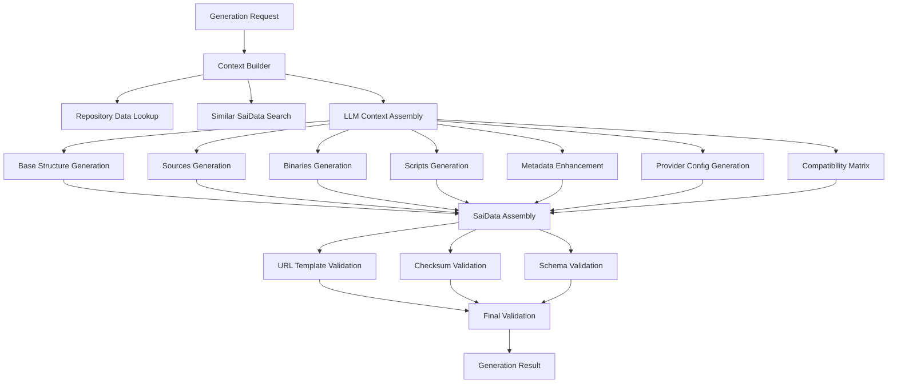

# Design Document

## Overview

The saidata generation system update for schema 0.3 introduces significant architectural changes to support new installation methods (sources, binaries, scripts), enhanced security metadata, and improved provider configuration structure. The design focuses on extending the existing generation engine while maintaining code quality and ensuring comprehensive coverage of the new schema features.

## Architecture

### Updated Core Components

```
saigen/
├── models/
│   ├── saidata.py          # Updated SaiData models for 0.3 schema
│   ├── sources.py          # New: Source build configuration models
│   ├── binaries.py         # New: Binary download configuration models
│   ├── scripts.py          # New: Script installation configuration models
│   └── security.py         # New: Security metadata models
├── core/
│   ├── generation_engine.py # Updated: Enhanced generation logic
│   ├── schema_validator.py  # Updated: 0.3 schema validation
│   └── template_processor.py # New: URL templating processor
├── llm/
│   ├── prompts/
│   │   ├── saidata_0_3.py  # New: 0.3 schema-specific prompts
│   │   ├── sources.py      # New: Source build prompts
│   │   ├── binaries.py     # New: Binary download prompts
│   │   └── scripts.py      # New: Script installation prompts
│   └── context_builder.py  # Updated: Enhanced context for new fields
└── utils/
    ├── url_templating.py    # New: URL template validation and processing
    ├── checksum_validator.py # New: Checksum format validation
    └── compatibility_matrix.py # New: Compatibility matrix utilities
```

## Components and Interfaces

### Enhanced SaiData Models

```python
@dataclass
class SaiDataV03:
    version: str = "0.3"
    metadata: Metadata
    packages: Optional[List[Package]] = None
    services: Optional[List[Service]] = None
    files: Optional[List[File]] = None
    directories: Optional[List[Directory]] = None
    commands: Optional[List[Command]] = None
    ports: Optional[List[Port]] = None
    containers: Optional[List[Container]] = None
    sources: Optional[List[Source]] = None  # New in 0.3
    binaries: Optional[List[Binary]] = None  # New in 0.3
    scripts: Optional[List[Script]] = None  # New in 0.3
    providers: Optional[Dict[str, ProviderConfig]] = None
    compatibility: Optional[Compatibility] = None

@dataclass
class EnhancedMetadata:
    name: str
    display_name: Optional[str] = None
    description: Optional[str] = None
    version: Optional[str] = None
    category: Optional[str] = None
    subcategory: Optional[str] = None
    tags: Optional[List[str]] = None
    license: Optional[str] = None
    language: Optional[str] = None
    maintainer: Optional[str] = None
    urls: Optional[URLs] = None
    security: Optional[SecurityMetadata] = None  # New in 0.3

@dataclass
class SecurityMetadata:
    cve_exceptions: Optional[List[str]] = None
    security_contact: Optional[str] = None
    vulnerability_disclosure: Optional[str] = None
    sbom_url: Optional[str] = None
    signing_key: Optional[str] = None

@dataclass
class URLs:
    website: Optional[str] = None
    documentation: Optional[str] = None
    source: Optional[str] = None
    issues: Optional[str] = None
    support: Optional[str] = None
    download: Optional[str] = None
    changelog: Optional[str] = None
    license: Optional[str] = None
    sbom: Optional[str] = None
    icon: Optional[str] = None
```

### New Installation Method Models

```python
@dataclass
class Source:
    name: str
    url: str
    build_system: BuildSystem
    version: Optional[str] = None
    build_dir: Optional[str] = None
    source_dir: Optional[str] = None
    install_prefix: Optional[str] = None
    configure_args: Optional[List[str]] = None
    build_args: Optional[List[str]] = None
    install_args: Optional[List[str]] = None
    prerequisites: Optional[List[str]] = None
    environment: Optional[Dict[str, str]] = None
    checksum: Optional[str] = None
    custom_commands: Optional[CustomCommands] = None

@dataclass
class Binary:
    name: str
    url: str
    version: Optional[str] = None
    architecture: Optional[str] = None
    platform: Optional[str] = None
    checksum: Optional[str] = None
    install_path: Optional[str] = None
    executable: Optional[str] = None
    archive: Optional[ArchiveConfig] = None
    permissions: Optional[str] = None
    custom_commands: Optional[CustomCommands] = None

@dataclass
class Script:
    name: str
    url: str
    version: Optional[str] = None
    interpreter: Optional[str] = None
    checksum: Optional[str] = None
    arguments: Optional[List[str]] = None
    environment: Optional[Dict[str, str]] = None
    working_dir: Optional[str] = None
    timeout: Optional[int] = None
    custom_commands: Optional[CustomCommands] = None

class BuildSystem(Enum):
    AUTOTOOLS = "autotools"
    CMAKE = "cmake"
    MAKE = "make"
    MESON = "meson"
    NINJA = "ninja"
    CUSTOM = "custom"
```

### Enhanced Provider Configuration

```python
@dataclass
class ProviderConfigV03:
    prerequisites: Optional[List[str]] = None
    build_commands: Optional[List[str]] = None
    packages: Optional[List[Package]] = None
    package_sources: Optional[List[PackageSource]] = None
    repositories: Optional[List[Repository]] = None
    services: Optional[List[Service]] = None
    files: Optional[List[File]] = None
    directories: Optional[List[Directory]] = None
    commands: Optional[List[Command]] = None
    ports: Optional[List[Port]] = None
    containers: Optional[List[Container]] = None
    sources: Optional[List[Source]] = None  # New in 0.3
    binaries: Optional[List[Binary]] = None  # New in 0.3
    scripts: Optional[List[Script]] = None  # New in 0.3

@dataclass
class PackageSource:
    name: str
    repository: str
    packages: List[Package]
    priority: Optional[int] = None
    recommended: Optional[bool] = None
    notes: Optional[str] = None

@dataclass
class Repository:
    name: str
    url: Optional[str] = None
    key: Optional[str] = None
    type: Optional[RepositoryType] = None
    components: Optional[List[str]] = None
    maintainer: Optional[str] = None
    priority: Optional[int] = None
    recommended: Optional[bool] = None
    notes: Optional[str] = None
    # Resource overrides for this repository
    packages: Optional[List[Package]] = None
    services: Optional[List[Service]] = None
    files: Optional[List[File]] = None
    directories: Optional[List[Directory]] = None
    commands: Optional[List[Command]] = None
    ports: Optional[List[Port]] = None
    containers: Optional[List[Container]] = None
    sources: Optional[List[Source]] = None
    binaries: Optional[List[Binary]] = None
    scripts: Optional[List[Script]] = None
```

### URL Templating System

```python
class URLTemplateProcessor:
    """Handles URL templating with placeholders"""
    
    SUPPORTED_PLACEHOLDERS = {
        'version': 'Software version',
        'platform': 'Target platform (linux, darwin, windows)',
        'architecture': 'Target architecture (amd64, arm64, 386)'
    }
    
    def validate_template(self, url_template: str) -> ValidationResult:
        """Validate URL template syntax and placeholders"""
        
    def render_template(self, url_template: str, context: TemplateContext) -> str:
        """Render URL template with provided context"""
        
    def extract_placeholders(self, url_template: str) -> List[str]:
        """Extract all placeholders from URL template"""

@dataclass
class TemplateContext:
    version: Optional[str] = None
    platform: Optional[str] = None
    architecture: Optional[str] = None
    
    @classmethod
    def auto_detect(cls) -> 'TemplateContext':
        """Auto-detect platform and architecture"""
```

### Enhanced Generation Engine

```python
class GenerationEngineV03:
    """Updated generation engine for saidata 0.3 schema"""
    
    def __init__(self, llm_manager: LLMManager, repository_manager: RepositoryManager):
        self.llm_manager = llm_manager
        self.repository_manager = repository_manager
        self.template_processor = URLTemplateProcessor()
        self.checksum_validator = ChecksumValidator()
        
    async def generate_saidata(self, request: GenerationRequest) -> GenerationResult:
        """Generate saidata using 0.3 schema"""
        
        # Build enhanced context with new fields
        context = await self._build_generation_context(request)
        
        # Generate base saidata structure
        base_saidata = await self._generate_base_structure(request, context)
        
        # Generate installation methods
        sources = await self._generate_sources(request, context)
        binaries = await self._generate_binaries(request, context)
        scripts = await self._generate_scripts(request, context)
        
        # Generate enhanced metadata
        metadata = await self._generate_enhanced_metadata(request, context)
        
        # Generate provider configurations
        providers = await self._generate_provider_configs(request, context)
        
        # Generate compatibility matrix
        compatibility = await self._generate_compatibility_matrix(request, context)
        
        # Assemble final saidata
        saidata = SaiDataV03(
            version="0.3",
            metadata=metadata,
            packages=base_saidata.packages,
            services=base_saidata.services,
            files=base_saidata.files,
            directories=base_saidata.directories,
            commands=base_saidata.commands,
            ports=base_saidata.ports,
            containers=base_saidata.containers,
            sources=sources,
            binaries=binaries,
            scripts=scripts,
            providers=providers,
            compatibility=compatibility
        )
        
        # Validate against 0.3 schema
        validation_result = await self._validate_saidata(saidata)
        
        return GenerationResult(
            success=validation_result.is_valid,
            saidata=saidata,
            validation_errors=validation_result.errors,
            warnings=validation_result.warnings
        )
```

### LLM Prompt Updates

```python
class SaiDataV03Prompts:
    """Updated prompts for saidata 0.3 generation"""
    
    BASE_PROMPT = """
Generate a saidata YAML file for the software: {software_name}
Use saidata schema version 0.3 with the following structure:

version: "0.3"
metadata:
  name: {software_name}
  # Include enhanced metadata with security information
sources:
  # Source build configurations with build systems
binaries:
  # Binary download configurations with templating
scripts:
  # Script installation configurations with security
providers:
  # Provider-specific configurations and overrides
compatibility:
  # Compatibility matrix and version information
"""

    SOURCES_PROMPT = """
Generate source build configurations for {software_name}:

Include:
- URL with templating: {{{{version}}}}, {{{{platform}}}}, {{{{architecture}}}}
- build_system: autotools, cmake, make, meson, ninja, or custom
- configure_args, build_args, install_args arrays
- prerequisites for build dependencies
- checksum in format "algorithm:hash"
- custom_commands for overriding default behavior

Example:
sources:
  - name: main
    url: "https://example.com/{{{{version}}}}/source.tar.gz"
    build_system: autotools
    configure_args: ["--enable-ssl", "--with-modules"]
    prerequisites: ["build-essential", "libssl-dev"]
    checksum: "sha256:abc123..."
"""

    BINARIES_PROMPT = """
Generate binary download configurations for {software_name}:

Include:
- URL with templating for platform/architecture
- install_path (default: /usr/local/bin)
- archive configuration for extraction
- permissions in octal format
- custom_commands for installation steps

Example:
binaries:
  - name: main
    url: "https://releases.example.com/{{{{version}}}}/binary_{{{{platform}}}}_{{{{architecture}}}}.zip"
    install_path: "/usr/local/bin"
    executable: "binary_name"
    checksum: "sha256:def456..."
"""

    SCRIPTS_PROMPT = """
Generate script installation configurations for {software_name}:

Include:
- HTTPS URLs for security
- checksum for verification
- interpreter (bash, sh, python, etc.)
- timeout (default 300, max 3600 seconds)
- arguments and environment variables

Example:
scripts:
  - name: official
    url: "https://get.example.com/install.sh"
    checksum: "sha256:ghi789..."
    interpreter: "bash"
    timeout: 600
    arguments: ["--channel", "stable"]
"""
```

### Schema Validation Updates

```python
class SchemaValidatorV03:
    """Enhanced validator for saidata 0.3 schema"""
    
    def __init__(self):
        self.schema = self._load_schema_0_3()
        self.url_processor = URLTemplateProcessor()
        self.checksum_validator = ChecksumValidator()
        
    def validate_saidata(self, saidata: dict) -> ValidationResult:
        """Comprehensive validation for 0.3 schema"""
        
        errors = []
        warnings = []
        
        # JSON schema validation
        schema_errors = self._validate_json_schema(saidata)
        errors.extend(schema_errors)
        
        # URL template validation
        url_errors = self._validate_url_templates(saidata)
        errors.extend(url_errors)
        
        # Checksum format validation
        checksum_errors = self._validate_checksums(saidata)
        errors.extend(checksum_errors)
        
        # Provider configuration validation
        provider_errors = self._validate_provider_configs(saidata)
        errors.extend(provider_errors)
        
        # Compatibility matrix validation
        compatibility_errors = self._validate_compatibility_matrix(saidata)
        errors.extend(compatibility_errors)
        
        return ValidationResult(
            is_valid=len(errors) == 0,
            errors=errors,
            warnings=warnings
        )
        
    def _validate_url_templates(self, saidata: dict) -> List[str]:
        """Validate URL templates in sources, binaries, scripts"""
        errors = []
        
        for section in ['sources', 'binaries', 'scripts']:
            if section in saidata:
                for item in saidata[section]:
                    if 'url' in item:
                        result = self.url_processor.validate_template(item['url'])
                        if not result.is_valid:
                            errors.extend(result.errors)
                            
        return errors
        
    def _validate_checksums(self, saidata: dict) -> List[str]:
        """Validate checksum format across all sections"""
        errors = []
        
        for section in ['sources', 'binaries', 'scripts']:
            if section in saidata:
                for item in saidata[section]:
                    if 'checksum' in item:
                        if not self.checksum_validator.is_valid_format(item['checksum']):
                            errors.append(f"Invalid checksum format in {section}: {item['checksum']}")
                            
        return errors
```

## Data Flow Architecture

### Generation Pipeline



### Context Enhancement

```python
class ContextBuilderV03:
    """Enhanced context builder for 0.3 generation"""
    
    async def build_context(self, request: GenerationRequest) -> GenerationContext:
        """Build comprehensive context for 0.3 generation"""
        
        base_context = await self._build_base_context(request)
        
        # Enhance with installation method context
        source_context = await self._build_source_context(request)
        binary_context = await self._build_binary_context(request)
        script_context = await self._build_script_context(request)
        
        # Enhance with security context
        security_context = await self._build_security_context(request)
        
        # Enhance with compatibility context
        compatibility_context = await self._build_compatibility_context(request)
        
        return GenerationContext(
            software_name=request.software_name,
            repository_data=base_context.repository_data,
            similar_saidata=base_context.similar_saidata,
            source_examples=source_context.examples,
            binary_examples=binary_context.examples,
            script_examples=script_context.examples,
            security_metadata=security_context.metadata,
            compatibility_matrix=compatibility_context.matrix,
            target_providers=request.target_providers
        )
```

## Error Handling

### Enhanced Error Types

```python
class SchemaV03Error(SaigenError):
    """Errors specific to 0.3 schema validation"""

class URLTemplateError(SchemaV03Error):
    """URL template validation errors"""

class ChecksumFormatError(SchemaV03Error):
    """Checksum format validation errors"""

class BuildSystemError(SchemaV03Error):
    """Build system configuration errors"""

class CompatibilityMatrixError(SchemaV03Error):
    """Compatibility matrix validation errors"""
```

### Validation Error Recovery

```python
class ValidationErrorRecovery:
    """Automatic recovery from common validation errors"""
    
    def attempt_recovery(self, saidata: dict, errors: List[str]) -> Tuple[dict, List[str]]:
        """Attempt to automatically fix common validation errors"""
        
        recovered_saidata = saidata.copy()
        remaining_errors = []
        
        for error in errors:
            if self._is_url_template_error(error):
                recovered_saidata = self._fix_url_template(recovered_saidata, error)
            elif self._is_checksum_format_error(error):
                recovered_saidata = self._fix_checksum_format(recovered_saidata, error)
            elif self._is_enum_value_error(error):
                recovered_saidata = self._fix_enum_value(recovered_saidata, error)
            else:
                remaining_errors.append(error)
                
        return recovered_saidata, remaining_errors
```

## Testing Strategy

### Schema Migration Testing

```python
class SchemaV03TestSuite:
    """Comprehensive test suite for 0.3 schema support"""
    
    def test_schema_validation(self):
        """Test validation against 0.3 schema"""
        
    def test_url_templating(self):
        """Test URL template processing"""
        
    def test_checksum_validation(self):
        """Test checksum format validation"""
        
    def test_build_system_configs(self):
        """Test source build configurations"""
        
    def test_binary_downloads(self):
        """Test binary download configurations"""
        
    def test_script_installations(self):
        """Test script installation configurations"""
        
    def test_provider_overrides(self):
        """Test provider-specific configurations"""
        
    def test_compatibility_matrix(self):
        """Test compatibility matrix generation"""
        
    def test_security_metadata(self):
        """Test security metadata generation"""
        
    def test_llm_prompt_updates(self):
        """Test updated LLM prompts for 0.3"""
```

### Integration Testing

- End-to-end generation with 0.3 schema
- Cross-validation with existing saidata files
- Provider compatibility testing
- URL template rendering in real scenarios
- Checksum verification workflows

## Performance Considerations

### Optimization Strategies

1. **Schema Caching**: Cache compiled 0.3 schema for validation
2. **Template Compilation**: Pre-compile URL templates for reuse
3. **Parallel Validation**: Validate different sections concurrently
4. **Incremental Updates**: Only regenerate changed sections during updates

### Memory Management

- Stream large repository data during context building
- Lazy load schema definitions
- Efficient string templating for URLs
- Garbage collection of temporary validation objects

## Migration Strategy

### Backward Compatibility

Since backward compatibility is not a concern, the migration strategy focuses on:

1. **Complete Schema Replacement**: Replace 0.2 schema with 0.3
2. **Model Updates**: Update all data models to 0.3 structure
3. **Prompt Replacement**: Replace all LLM prompts with 0.3 versions
4. **Validation Updates**: Update all validation logic for 0.3

### Deployment Plan

1. **Phase 1**: Update core models and schema validation
2. **Phase 2**: Update generation engine and LLM prompts
3. **Phase 3**: Update CLI commands and output formatting
4. **Phase 4**: Comprehensive testing and validation
5. **Phase 5**: Documentation updates and examples